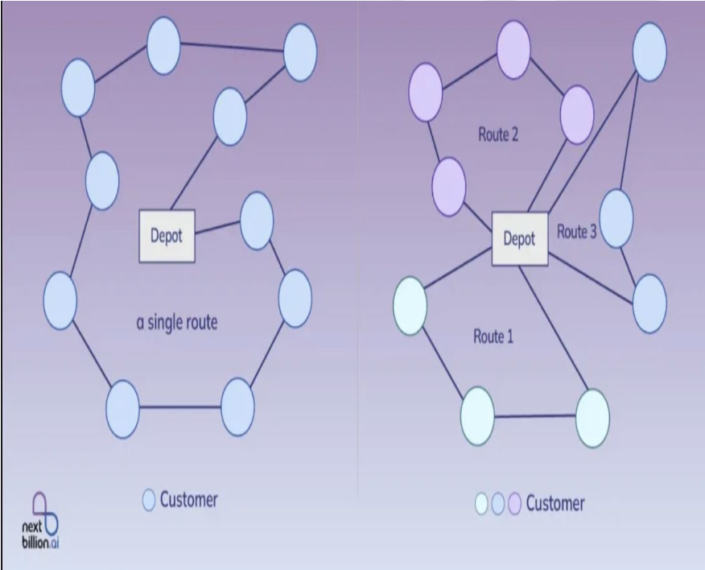

# Optimizing Vehicle Routes: A Solution to the Capacitated Vehicle Routing Problem with Time Windows

Efficient logistics and transportation are critical challenges faced by businesses in industries such as retail, e-commerce, and supply chain management. The Capacitated Vehicle Routing Problem with Time Windows (CVRPTW) is a classic combinatorial optimization problem that models real-world scenarios where a fleet of vehicles must deliver goods to customers while minimizing operational costs. Each vehicle operates under capacity constraints, and customers must be served within predefined time windows, adding complexity to the problem.

With the rapid growth of e-commerce and just-in-time delivery services, solving CVRPTW effectively has become increasingly important to reduce transportation costs, minimize environmental impact, and improve customer satisfaction. However, finding optimal solutions is computationally challenging due to the large solution space and multiple constraints.

This project focuses on addressing one main question:

1. How can we design efficient vehicle routes to minimize total travel distance while meeting capacity and time window constraints?

By tackling this question, this project aims to provide insights into solving real-world logistics problems using efficient heuristic methods and to identify areas for further improvement or exploration in routing optimization.

## Data Generator for Vehicle Routing Problem
This script generates synthetic datasets for Capacitated Vehicle Routing Problem (CVRP) and CVRP with Time Windows (CVRPTW). It supports various configurations and is designed to create multiple instances based on user-defined parameters.

### Prerequisites
Ensure Python and necessary libraries (numpy, pickle, argparse) are installed in your environment.

### Setup and Execution
Download the Script: Ensure data_generator.py is in your working directory or a known path.
Prepare Your Environment: Python 3.x and the libraries mentioned in the prerequisites should be installed.

### Usage
The script is executed via the command line, where you can specify various parameters for the data generation process:

* --dir (default: ./data): The directory to save the generated datasets.
* --name (required): Name of the dataset for identification.
* --problem (default: cvrp): Type of problem to generate data for (cvrp, cvrptw, or all for both).
* --size (default: 10000): Number of problem instances in the dataset.
* --graph_sizes (default: [20, 50, 100]): Sizes of the problem instances.
* --seed (default: 1234): Random seed for reproducibility.
* --service_window (default: 1000): Global time window for CVRPTW.
* --service_duration (default: 10): Service duration per node for CVRPTW.
* --time_factor (default: 100.0): Conversion factor from distances to time units.
* --tw_expansion (default: 3.0): Expansion factor of time windows relative to service duration.

### Example Command
To generate datasets, use the following command template:

    python data_generator.py --dir ./data --name testset --problem cvrp --size 1000 --graph_sizes 20 50 100 --seed 42

This command generates datasets for the CVRP problem with 1000 instances each for problem sizes of 20, 50, and 100, using a seed of 42 for random number generation, and saves them in the ./data/cvrp directory.

### Data Structure
Generated datasets are saved as Pickle files and are structured in named tuples with fields specific to the problem type:

* For CVRP: depot_loc, node_loc, demand, capacity.
* For CVRPTW: Adds depot_tw, node_tw, durations, service_window, time_factor.

## Optimization Algorithms Implemented
In this project, I have implemented and compared two prominent optimization algorithms to identify the most efficient solutions for our problem domain. Below are details on the algorithms and the specific parameters that were tuned during experiments:

1. Ant Colony Optimization (ACO)
Inspiration: Modeled after the foraging behavior of ants.
Mechanism: Utilizes pheromone trails and probabilistic exploration to construct efficient routes.
Parameters Tuned:
* alpha: Influence of pheromone trails.
* beta: Influence of heuristic information.
* rho: Rate of pheromone evaporation.
* q: Factor of pheromone deposit.

2. Tabu Search (TS)
Description: A metaheuristic that guides a local heuristic search procedure to explore the solution space beyond local optimality.
Mechanism: Employs a Tabu List to prevent cycling back to recently visited solutions, encouraging exploration of new areas.
Parameters Tuned:
* Maximum Iterations: Defines the stopping condition for the search.
* Tabu List Size: Determines the number of solutions to be excluded from reconsideration.

### Comparison of Algorithms
The performance of ACO and TS was rigorously evaluated to understand their efficacy in solving complex routing problems. A detailed comparison of these algorithms is provided, focusing on convergence speed, solution quality, and computational efficiency under various scenarios in the main.ipynb file.

